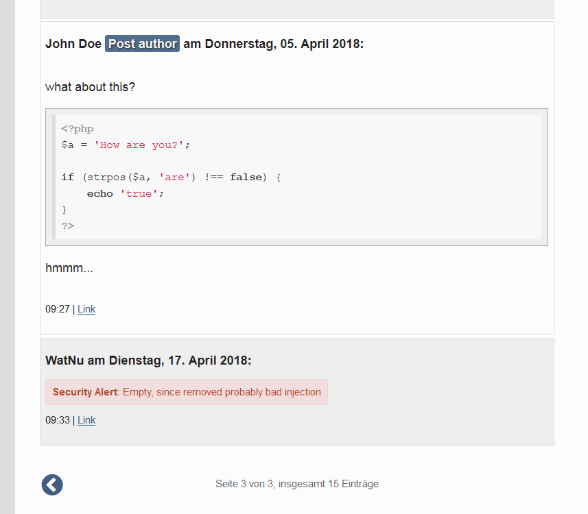

N° 2018/2 - The 2.5.0 release is out! Check the [ChangeLog](https://github.com/ophian/styx/blob/2.5.0/docs/NEWS) for details!
Serendipity Styx is PHP 7.2 ready and requires PHP from 5.5+!

## Styx 2.5.0 runs (...some highlights)

  - [NEW vs BETA] Various old and some new bugs were fixed. Example Gratia: the fixed bold markup interpretation of \*words\* by s9ymarkup or the XHTML-tag cleanup for ATOM feeds. Read the ChangeLog file.
  - [NEW vs BETA] Various THEMES were improved again, either updated, or revisited for certain places, like the shortcut pages for comments. Read on in the ChangeLog.
  - Various changes for encryption and hash generation were sorted out. Their usage depends on the PHP version used, getting stronger.
  - Multi cleanup for old bundled PEAR-libs and compatibility modes vs. update of external libs (Paragonie, simplePie, Pear, Smarty).
  - Various bug fixes, alongside with improvements like for the PLAIN TEXT Editor.
  - Set default Standard Backend 'template_backend' to Styx (2styx).
  - Add new "bootstrap 4" theme.
  - Multi changes and fixes for the Backend comments list, ie. the new moderate on/off buttons, or the new pending comment _hideaway_.
  - Regarding the European **G**eneral **D**ata **P**rotection **R**egulation Act, taking action on May 25th, all plugins and themes were changed or prepared to collect "legal impact" information data for the newly added serendipity_event_dsgvo_gdpr plugin, which adds "legal consent" actions to user forms or even the blog.
  - Themes changes were made for consistency (serendipity message selectors), for GDPR (in clean-blog, skeleton, timeline) and real improvements for post comment author owners (in 2k11, next).
  - The NL2BR plugin found a bad interpretation of the ISO-lation tag option and improved the NL2P (_experimental_) option. Please review your settings on upgrade!
  - Again some improving changes in the language constants.
  - Last, but not least, a new option arrived, to run secured HTML comments. This option allows having coding example parts in comments and comments generally displayed more nicely. Since being a heavy change with "security impact", this requires CHECKED comments, which should be your owners interest anyway!

It might be a good idea to take the advantage of starting a new copy template before adapting each single theme change to your old copy themes!

<picture>
    <source srcset="../i/b/improved-comments.avif" type="image/avif" />
    <source srcset="../i/b/improved-comments.webp" type="image/webp" />
    
</picture>

See [download](https://github.com/ophian/styx/releases/tag/2.5.0)